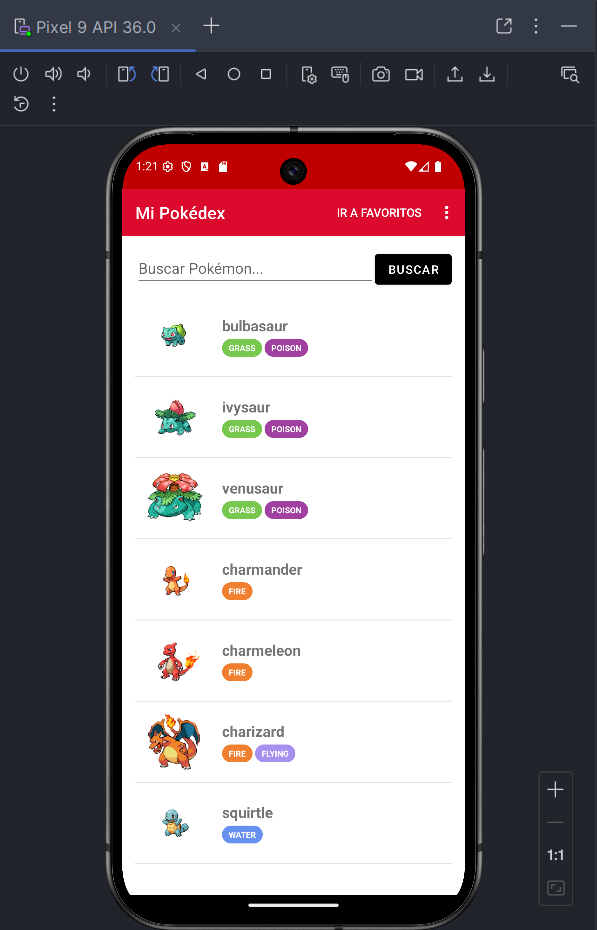
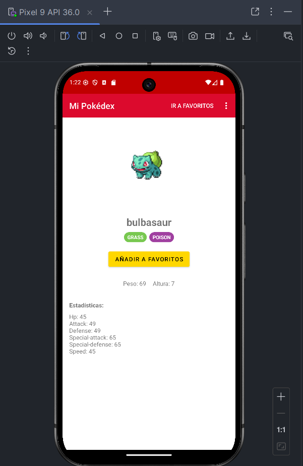
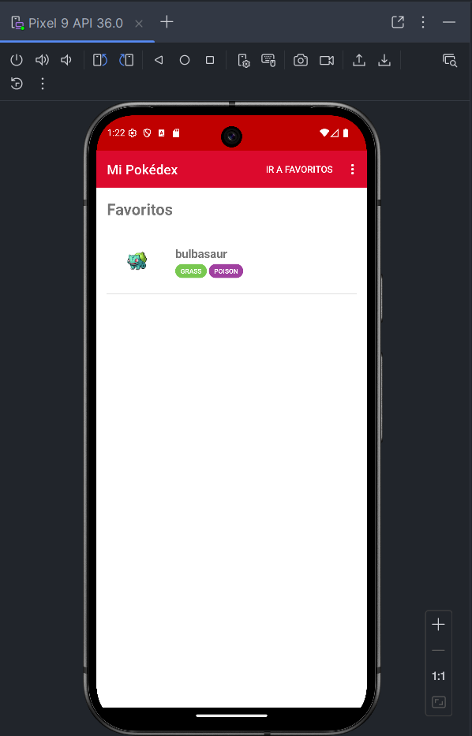

# TareaT2_EnzoSevillaGutierrez

Proyecto de aplicación Android para la Tarea T2.

## Descripción

Esta aplicación es una Pokédex sencilla desarrollada como parte de la asignatura de Programación Multimedia y Dispositivos Móviles. Permite visualizar una lista de Pokémon y sus detalles.

## Galería

Aquí se muestran algunas capturas de la aplicación:

